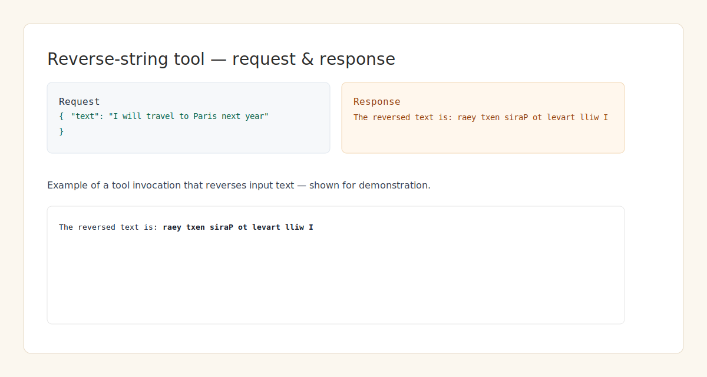
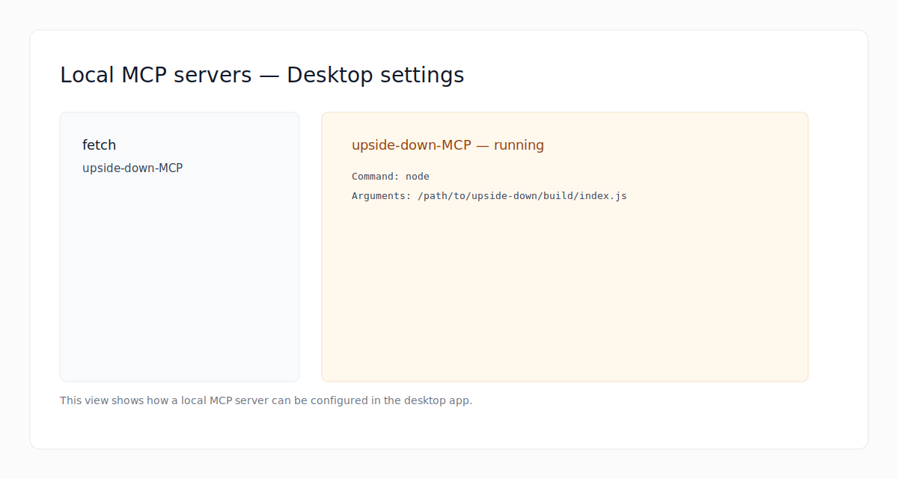
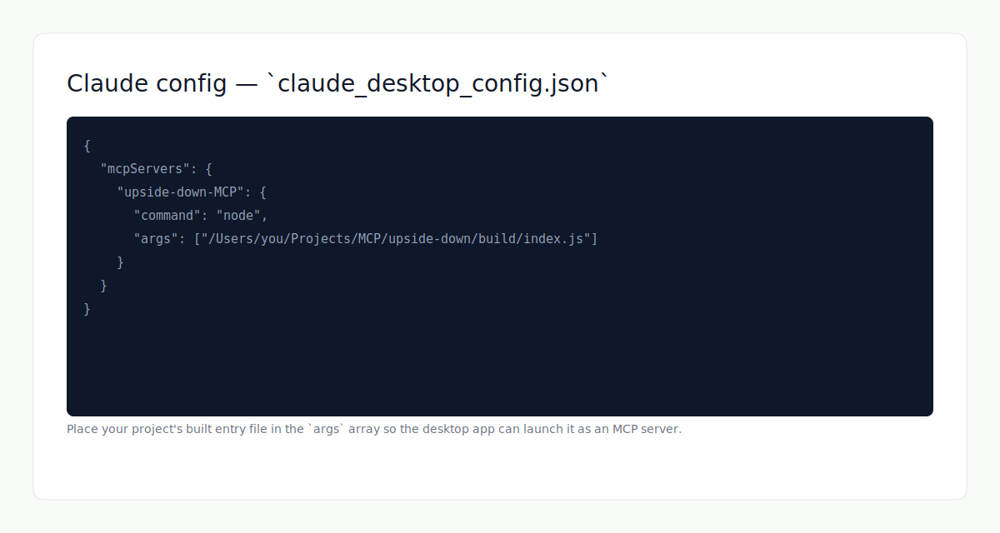

**Upside-Down**

A small TypeScript project that compiles to `build/index.js`. This repository contains a minimal TypeScript app using the Model Context Protocol SDK and `zod` for validation.

**Highlights**
- **Language:** TypeScript
- **Entry point (source):** `src/index.ts`
- **Built output:** `build/index.js`
- **Build tool:** TypeScript compiler (`tsc`)

# Upside‑Down

A concise, focused TypeScript example that demonstrates running a local MCP (Model Context Protocol) server and integrating with MCP-aware desktop apps.



## Why this repo?

- Shows a minimal, real-world pattern to expose a Node process as an MCP server so desktop assistants (or other MCP clients) can invoke tools and exchange structured context.

## Highlights

- **Language:** TypeScript
- **Source:** `src/index.ts`
- **Built output:** `build/index.js`
- **Build:** `npm run build` (TypeScript compiler)
- **Libraries:** `@modelcontextprotocol/sdk`, `zod`

## Table of contents

- [Screenshots](#screenshots)
- [What is MCP?](#what-is-mcp)
- [Quick start](#quick-start)
- [Configure your desktop app (example)](#configure-your-desktop-app-example)
- [Development tips](#development-tips)
- [Contributing](#contributing)

## Screenshots

Below are three illustrations (screenshot placeholders) showing: (1) a tool invocation and reversed-text response, (2) the desktop app MCP servers view, and (3) an example `claude_desktop_config.json` snippet that registers the local server.

### Reverse-string tool


*A request/response example for a simple reverse-string tool.*

### Local MCP servers (Desktop)



*How a local MCP server appears in the desktop app settings.*

### Desktop config snippet



*An example `claude_desktop_config.json` entry — replace the path in `args` with your build output.*

## What is MCP?

The Model Context Protocol (MCP) is a convention and SDK for exchanging structured context and metadata between tools and models. It allows model-driven UIs and desktop assistants to discover and invoke local services (tools) with clear contracts.

## Quick start

Prerequisites:

- Node.js v18+ (recommended)
- npm

Install dependencies and build:

```bash
cd upside-down
npm install
npm run build
```

Run the compiled server (example):

```bash
node build/index.js
```

### Example desktop config

If your desktop assistant expects a JSON config (example `claude_desktop_config.json`), point the `args` to the built entry, e.g.:

```json
{
	"mcpServers": {
		"upside-down-MCP": {
			"command": "node",
			"args": ["/absolute/path/to/upside-down/build/index.js"]
		}
	}
}
```

## Development tips

- Add a `dev` script for iterative development (example using `ts-node` + `nodemon`):

```bash
npm install -D nodemon ts-node
npm set-script dev "nodemon --watch 'src/**/*.ts' --exec 'ts-node' src/index.ts"

npm run dev
```

- This project uses `type: "module"` in `package.json`. Use ESM imports and ensure Node is recent enough.

## Contributing

- Improvements, bug reports, and additional example integrations are welcome. Open an issue or PR.

## License

This repo lists `ISC` in `package.json`. Add a `LICENSE` file if you want to clarify terms.
